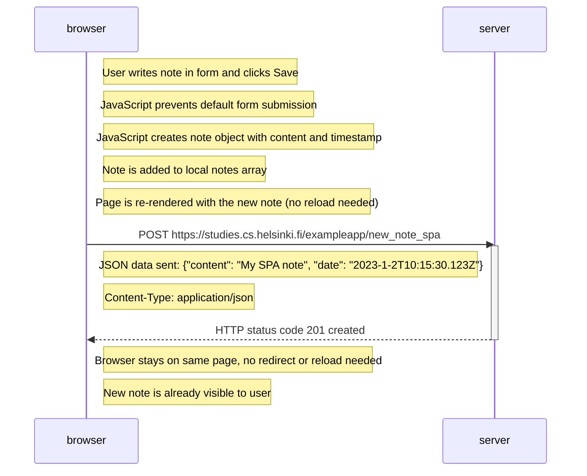

# Exercise 0.6: New note in Single page app diagram

This diagram depicts the sequence of events when a user creates a new note using the single-page app version of the notes application.

```mermaid
sequenceDiagram
    participant browser
    participant server

    Note right of browser: User writes note in form and clicks Save
    Note right of browser: JavaScript prevents default form submission
    Note right of browser: JavaScript creates note object with content and timestamp
    Note right of browser: Note is added to local notes array
    Note right of browser: Page is re-rendered with the new note (no reload needed)

    browser->>server: POST https://studies.cs.helsinki.fi/exampleapp/new_note_spa
    activate server
    Note right of browser: JSON data sent: {"content": "My SPA note", "date": "2023-1-2T10:15:30.123Z"}
    Note right of browser: Content-Type: application/json
    server-->>browser: HTTP status code 201 created
    deactivate server

    Note right of browser: Browser stays on same page, no redirect or reload needed
    Note right of browser: New note is already visible to user
```
